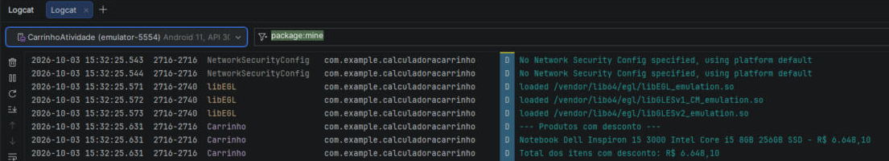

# Calculadora de Carrinho de Compras

App Android em Kotlin com Jetpack Compose que mostra os itens de um carrinho, calcula subtotal, descontos e total, e imprime no Logcat um relatório dos produtos com desconto.

Nome: Yago Uran Kurashiki Rios

## Prints

Emulador:

Logcat:

## Como rodar

1. Clonar o repositório e abrir a pasta no Android Studio
2. Esperar o Gradle sincronizar
3. Rodar no emulador ou em um celular (Run 'app')

O relatório aparece no Logcat filtrando pela tag `Carrinho`.

## Vídeo

Link: https://youtu.be/1UBxoTNvfZs
